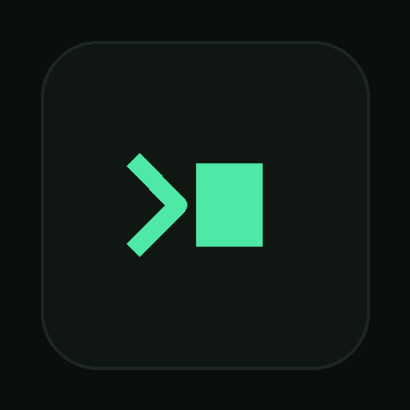

# 📝 TermNote

<p align="center">
  <strong>A lightweight, terminal-styled desktop notepad built with Electron.</strong>
</p>

<p align="center">
  Write. Organize. Customize. 🚀
</p>

<p align="center">
  
</p>

---

## ✨ Features

* 📝 **Markdown Editing** — Write notes using Markdown syntax.
* 👁️ **Live Preview** — See your formatted Markdown as you write.
* 🖼️ **Image Paste** — Quickly paste images directly into your notes.
* 🎨 **Themes** — Customize the appearance of your workspace.
* 🔤 **Font Customization** — Adjust the writing experience to your preference.
* ⌨️ **Command Palette** — Quickly access app actions using the keyboard.
* 💻 **Native Desktop App** — Runs as a standalone Electron application.
* ⚡ **Fast & Lightweight** — Designed to stay simple and responsive.
* 🪟 **Windows Installer** — Build and install TermNote like a normal desktop application.

---

## 🖥️ Preview

> Add screenshots of TermNote here.

[TermNote Screenshot](screenshots/main.png)


---

## 🛠️ Tech Stack

| Technology           | Purpose                              |
| -------------------- | ------------------------------------ |
| ⚡ Electron           | Desktop application framework        |
| 🌐 HTML              | Application structure                |
| 🎨 CSS               | Interface and styling                |
| ⚙️ JavaScript        | Application logic                    |
| 📦 Node.js           | Runtime and package management       |
| 🏗️ Electron Builder | Application packaging and installers |

---

## 🚀 Getting Started

### Prerequisites

Make sure you have:

* [Node.js](https://nodejs.org/)
* npm
* Git

### Clone the Repository

```bash
git clone https://github.com/SriramBharath-7/termnote.git
cd termnote
```

### Install Dependencies

```bash
npm install
```

### Start TermNote

```bash
npm start
```

TermNote will open as a native desktop application.

---

## 📦 Build the Windows Installer

To create a distributable Windows installer:

```bash
npm run dist
```

Electron Builder will package the application and place the generated files inside:

```text
dist/
```

The Windows installer can then be launched from the generated `.exe` file.

---

## 📁 Project Structure

```text
termnote/
│
├── 📁 assets/
│   ├── 🖼️ icon.png
│   ├── 🖼️ icon-512.png
│   └── 🪟 icon.ico
│
├── 📄 index.html
├── ⚙️ main.js
├── 📦 package.json
├── 🔒 package-lock.json
├── 📚 README.md
├── 📜 LICENSE
└── 🚫 .gitignore
```

---

## 🎯 Project Goals

TermNote was created as a practical Electron desktop application with a focus on:

* Simplicity
* Distraction-free writing
* Markdown workflows
* Customization
* Keyboard-driven productivity
* A clean terminal-inspired interface

The project also serves as a hands-on exploration of building, packaging, and distributing a real desktop application.

---

## 🗺️ Roadmap

### Current

* [x] Electron desktop application
* [x] Markdown editing
* [x] Markdown preview
* [x] Image paste support
* [x] Themes
* [x] Font customization
* [x] Command palette
* [x] Custom application icons
* [x] Windows installer

### Future

* [ ] Auto-save
* [ ] Multiple notes
* [ ] Search across notes
* [ ] Note folders
* [ ] Export to Markdown
* [ ] Export to PDF
* [ ] Keyboard shortcut customization
* [ ] Cross-platform release improvements

---

## 🤝 Contributing

Contributions, suggestions, and ideas are welcome.

If you find a bug or have an idea for improving TermNote, feel free to open an issue or submit a pull request.

---

## 📜 License

TermNote is released under the **MIT License**.

See [`LICENSE`](LICENSE) for details.

---

## 👨‍💻 Author

**Sriram Bharath**

Built with ☕, curiosity, and way too many terminal commands.

---

<p align="center">
  <strong>📝 TermNote — Your notes, your workflow.</strong>
</p>
